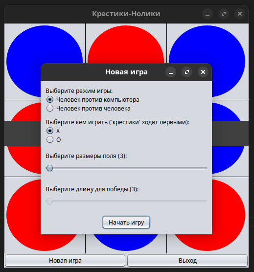

## Java Swing: Графический интерфейс на примере игры Крестики-нолики.

### Изменения:

* Логика игры и представление разделены: пакеты [domain](src/domain) и
[gui](src/gui) соответственно.
* Добавлена интерактивность компонентам окна `SettingsWindow`: отображение текущих
значений слайдеров, зависимость диапазона слайдера от значения другого слайдера.
* Обработчики событий компонентов и игры в окне `SettingsWindow` вынесены в отдельные
методы класса окна вместо использования экземпляров анонимных классов слушателей.
* Центрирование главного окна относительно экрана и окна настроек относительно
главного.
* Прочие улучшения...

*Компоновка окна настроек:*

*Главное окно с игровым полем:*

